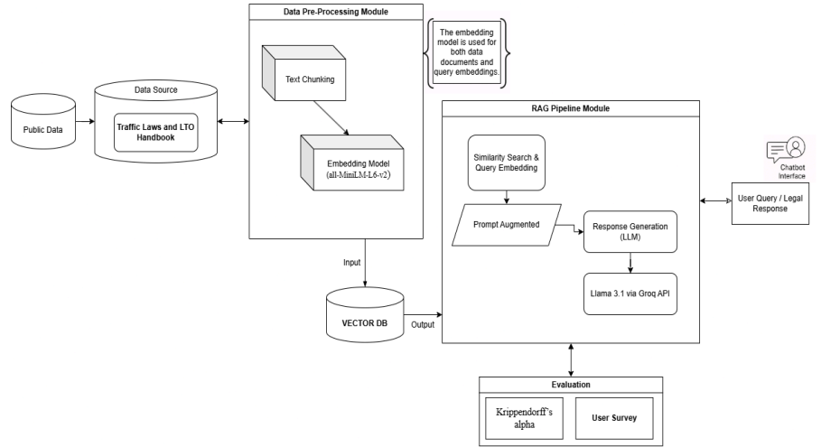

# Traffic Law Chatbot - Setup Guide

This guide provides instructions on how to set up the environment variables and run both the FastAPI backend and the Vite+React frontend.

## Prerequisites
- **Node.js** (v16 or higher)
- **Python** (3.9 or higher)

---

## 1. Environment Variables Setup

You will need to create `.env` files for both the backend and frontend. 

### Backend Environment Variables (`backend/.env`)
Create a `.env` file inside the `backend/` directory. You can use the provided `example.env` as a template or use the following structure:

```env
# Database configuration
user=your_db_user
password=your_db_password
host=your_db_host
port=5432
dbname=postgres

SUPABASE_DB_URL=postgresql+psycopg2://${user}:${password}@${host}:${port}/${dbname}?sslmode=require

# External APIs
GROQ_API_KEY="your_groq_api_key"
GROQ_PROD_KEY="your_groq_prod_key"

# Data paths (adjust to your system)
DATA_RAW_PATH="D:/Projects/trafficlaw_chatbot/data/raw"
DATA_PROCESSED_PATH="D:/Projects/trafficlaw_chatbot/data/processed"
EVAL_TESTSET_PATH="D:/Projects/trafficlaw_chatbot/data/evaluation_testset.csv"
```

### Frontend Environment Variables (`frontend/.env`)
Create a `.env` file inside the `frontend/` directory with the following structure:

```env
# URL for the backend API.
# Leave unset for local development (Vite proxies /api/* to http://127.0.0.1:8000)
# Set to your production backend URL for deployments (e.g., https://your-service.onrender.com)
# VITE_API_URL=
```

---

## 2. Running the Backend (FastAPI)

The backend is built with FastAPI. To run it locally, follow these steps:

1. Open a terminal and navigate to the `backend` directory:
   ```bash
   cd backend
   ```

2. (Optional but recommended) Create and activate a virtual environment:
   ```bash
   python -m venv venv
   # On Windows:
   .\venv\Scripts\activate
   # On macOS/Linux:
   source venv/bin/activate
   ```

3. Install the required dependencies:
   ```bash
   pip install -r requirements.txt
   ```

4. Start the FastAPI development server:
   ```bash
   uvicorn main:app --reload
   ```
   The backend will now be running at `http://127.0.0.1:8000`.

---

## 3. Running the Frontend (Vite + React)

The frontend is built with React and Vite. To run it locally, follow these steps:

1. Open a new terminal and navigate to the `frontend` directory:
   ```bash
   cd frontend
   ```

2. Install the dependencies:
   ```bash
   npm install
   ```

3. Start the Vite development server:
   ```bash
   npm run dev
   ```
   The frontend will now be accessible via your browser (typically at `http://localhost:5173`).
  
  ## RAG System Architecture
  
